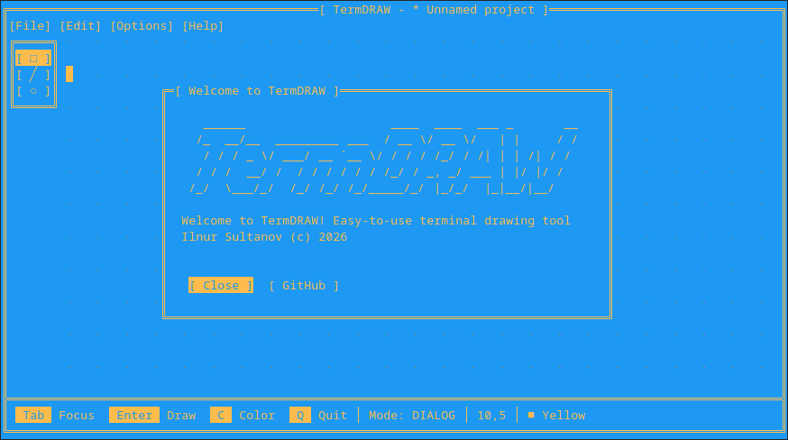
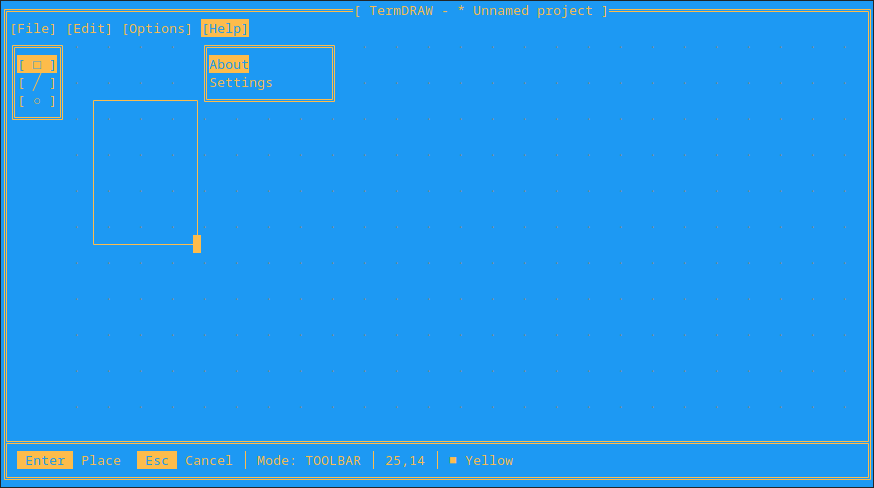

# TermDRAW




## Description
A lightweight and easy to use 2D CAD-like drawing tool in terminal.

## Features
- Classic DOS-style TUI interface with keyboard navigation
- Interactive drawing tools: rectangles and lines
- Multiple DOS ANSI colors
- Custom `.td` file format (save and load)
- Export to PNG, BMP, and JPG

## Build and run
```bash
g++ -std=c++17 main.cpp src/*.cpp -o td
./td
```

## AI usage
No AI was used. This is not a vibecoded project, just a pure human slop :)

## License
[MIT](LICENSE)
